# 系统使用说明书

## 编译方法

在 `binary` 文件夹内有已经编译好可执行文件。由于不同机器运行环境和配置的差异，预编译的可执行文件不保证在所有机器上都可用，如果预编译的文件无法打开，请尝试在本机重新编译。

以下是用于编译的工具及其版本：

- 操作系统：Ubuntu 18.04.2 LTS
- C++编译器： g++ 7.3.0
- make工具： GNU Make 4.1
- Qt和QMake工具： QMake version 3.1, using Qt version 5.9.5
- shell：GNU bash, version 4.4.19

如果需要编译目标文件，请切换到根目录并输入

```bash
make targets
```

可执行文件位于`build/painter` (CLI版本) 和 `build/painter-gui` (GUI版本)。

要清除已有的目标文件和中间文件，请输入

```bash
make clean
```

## 程序运行方法

### CLI程序运行方法

可以输入`binary/painter`的方式调用CLI程序。CLI程序运行方法如下：

```
Usage: painter [ -i ] [ input [ output_dir ] ]

-i          Use mathematical coordinate system.
input       The input file. If omitted, read from stdin.
output_dir	The output directory. If omitted, output to current working directory.
```

CLI程序接受两个参数（input和output_dir）以及一个标志-i，它们的含义如下：

1. input：指定输入文件。当input省略时，默认从标准输入读入。
2. output_dir：指定输出文件夹。当output_dir被省略时，默认输出到当前目录。
3. -i：使用数学坐标系。CLI程序默认使用绘图坐标系，即原点位于画布左上方，x轴方向为原点向右，y轴方向为原点向下；当开启-i时，使用数学坐标系，即原点位于画布左下方，x轴方向为原点向右，y轴方向为原点向下。

### GUI程序运行方法

直接打开GUI程序即可。可在命令行中输入`binary/painter-gui`的方式打开。

## 系统使用说明

### CLI程序使用说明

CLI程序输入由若干条命令构成。可以使用#添加注释，#之后直到行末的所有字符都将被视为注释。CLI输入的命令均区分大小写，如果大小写不正确会导致错误。CLI程序支持的命令如下：

1. resetCanvas
   使用格式：`resetCanvas width height`
   功能说明：清除整个画布，并将画布的宽度和高度分别设为width和height。

2. resize

   使用格式：`resize width height`

   功能说明：将画布的宽度和高度分别设为width和height，但不清空画布内容。

3. saveCanvas
   使用格式：`saveCanvas filename`

   功能说明：将当前画布上的图像以bmp格式保存到filename指定的文件中。

4. setColor
   使用格式：`setColor r g b`
   功能说明：将当前画笔颜色设为$(r, g, b)$，$r, g, b$分别表示颜色的红色分量、绿色分量和蓝色分量。其中$r,g,b$为整数且满足$0 \leq r, g, b < 256$。

5. drawLine
   使用格式：`drawLine id x1 y1 x2 y2 algorithm`
   使用说明：绘制直线。其中，`id`为图元编号，`(x1, y1)`为起点坐标，`(x2, y2)`为终点坐标。`algorithm`表示画线算法，可选的画线算法有`DDA`和`Bresenham`两种。

6. drawPolygon

   使用格式：

   ```
   drawPolygon id n algorithm
   x1 y1 x2 y2 ...
   ```

   功能说明：绘制多边形。其中`id`为图元编号，`n`为多边形的顶点数，`algorithm`表示画线算法，可选的画线算法有`DDA`和`Bresenham`两种。`(x1, y1), (x2, y2), ..., (xn, yn)`依次给出每个顶点的坐标。

7. drawEllipse

   使用格式：`drawEllipse id x y rx ry`

   功能说明：使用中点法绘制椭圆。其中`id`为图元编号，$(x, y)$为椭圆中心坐标，`rx, ry`为椭圆在x轴方向和y轴方向的两个半轴的长度。

8. drawCurve

   使用格式：

   ```
   drawCurve id n algorithm
   x1 y1 x2 y2 ...
   ```

   功能说明：绘制曲线。其中`id`为图元编号，`n`为曲线控制点数目，`algorithm`表示画线算法，可选的画线算法有`Bezier`和`B-Spline`两种。其中，B-Spline曲线默认绘制3阶（4次）准均匀样条曲线；但当控制点个数小于次数时，绘制同次数的Bezier曲线。为`(x1, y1), (x2, y2), ..., (xn, yn)`依次给出每个控制点的坐标。

9. translate

   使用格式：`translate id dx dy`

   功能说明：对图元进行平移操作。其中`id`为图元编号，`(dx, dy)`为平移的方向向量。

10. rotate

    使用格式：`rotate id x y r`

    功能说明：对图元进行旋转操作。其中`id`为图元编号，$(x, y)$为旋转中心，$r$为旋转的角度。当使用绘图坐标系时，旋转方向为逆时针；当使用数学坐标系时，旋转方向为顺时针。

11. scale

    使用格式：`scale id x y s`

    功能说明：对图元进行缩放操作。其中`id`为图元编号，$(x, y)$为缩放中心，$s$为缩放倍数。

12. clip

    使用格式：`clip id x1 y1 x2 y2 algorithm`

    功能说明：对线段进行裁剪操作。其中`id`为线段图元的编号，`(x1, y1), (x2, y2)`为裁剪窗口两个对角的坐标，`algorithm`为裁剪算法。可选的裁剪算法有`Cohen-Sutherland`和`Liang-Barsky`。

### GUI程序使用说明

打开GUI程序，界面如下所示：

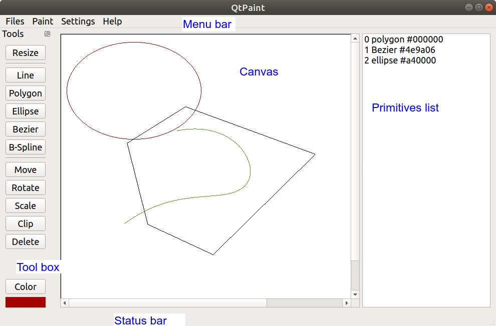

整个图形界面分为菜单栏（上侧），工具栏（左侧），绘图区（中部），图元列表（右侧）和状态栏（下侧）这几部分。图形界面使用Qt Creator工具设计。图形界面各个功能的使用方法如下所述。

#### 文件保存

点击菜单栏-Files-Save，在弹出的对话框中输入保存文件的文件名（包括后缀名），即可保存到文件中。支持bmp，jpg，png等常见图片格式。

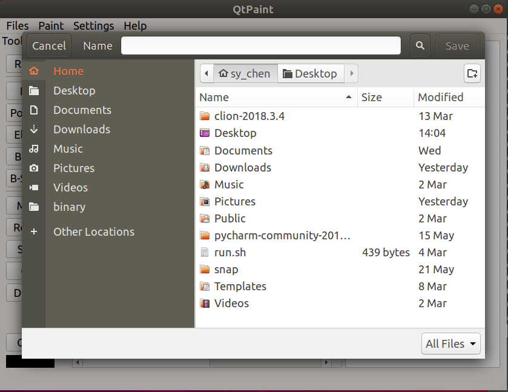

#### 算法选择

GUI程序默认使用Bresenham划线算法和Liang-Barsky裁剪算法。若要使用DDA算法或Cohen-Sutherland算法，可在菜单栏-Settings中勾选相关选项。

#### 颜色设置

点击工具栏中的Color按钮（或者菜单栏中Paint-Color选项），在弹出的对话框中可以改变当前颜色。

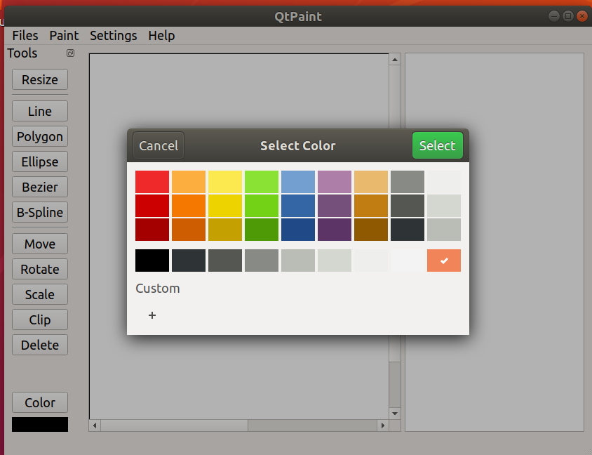

#### 调整画布大小

点击工具栏中的Resize按钮（或者选择菜单栏Paint-Resize选项），在弹出的对话框中依次输入新画布的宽度和高度，即可调整画布大小。

#### 图元绘制

图元绘制命令在工具栏中提供。菜单栏的Paint中也提供了功能相同的选项。

##### 绘制直线

点击Line按钮，在画布上依次单击选择起点和终点，即可完成直线的绘制。

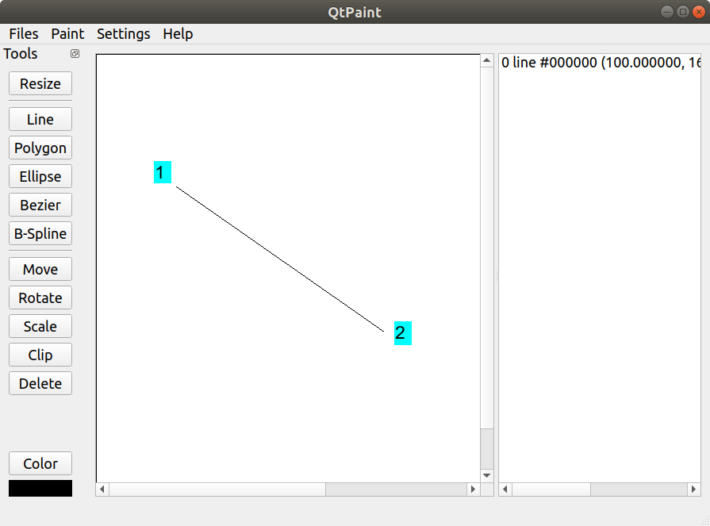

##### 绘制多边形

点击Polygon按钮，在画布上依次单击选择多边形的每个顶点，最后一个顶点需要右击表示绘制结束。

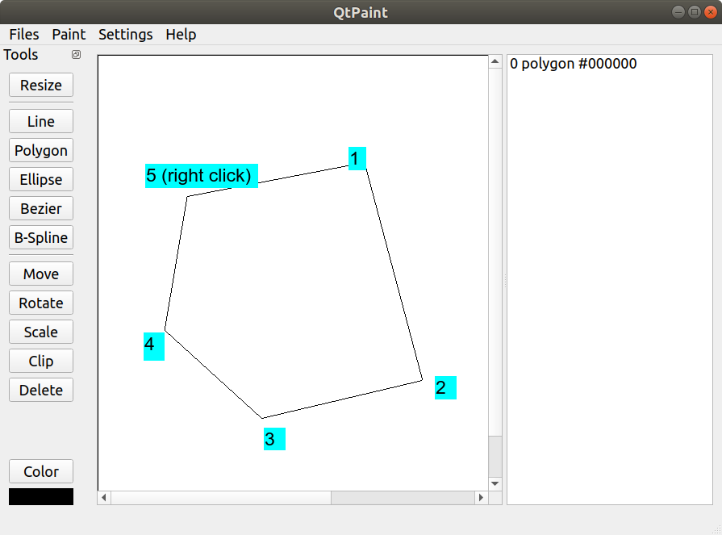

##### 绘制椭圆

点击Ellipse按钮，然后依次点击椭圆的中心和包裹椭圆的正交长方形的一个顶点即可完成绘制。

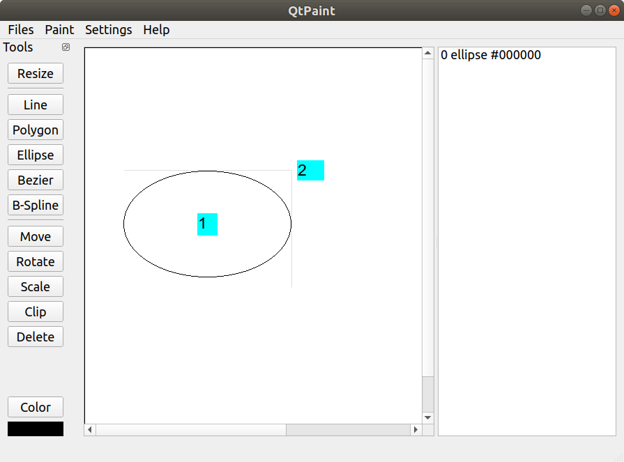

##### 绘制曲线

点击Bezier或B-Spline按钮，然后依次点击曲线的每个控制点，最后一个控制点需要右击表示绘制结束。

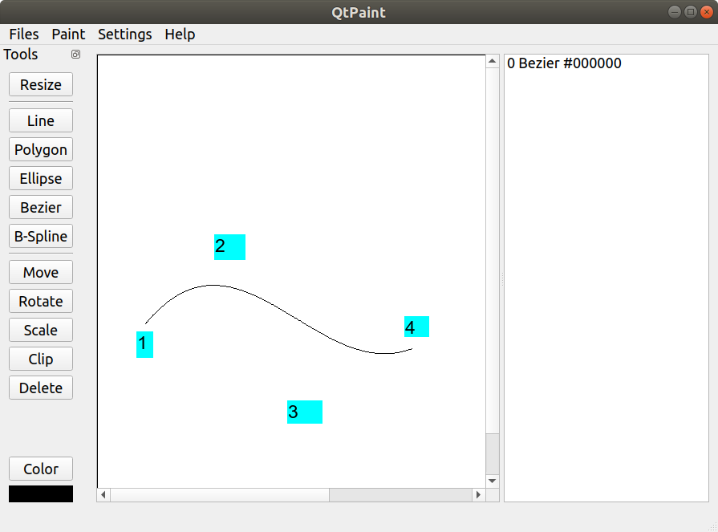

#### 图元操作

##### 平移

首先在右侧的图元列表选择要移动的图元，然后点击Move按钮。在画布上选择平移向量的起点和中点，即可完成平移。

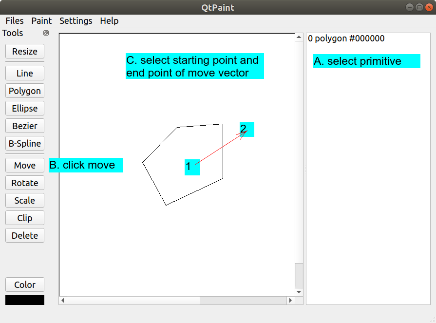

##### 旋转

首先在右侧的图元列表选择要移动的图元，然后点击Rotate按钮。在画布上选择旋转的中心点，随后选择两个点确定旋转角度。

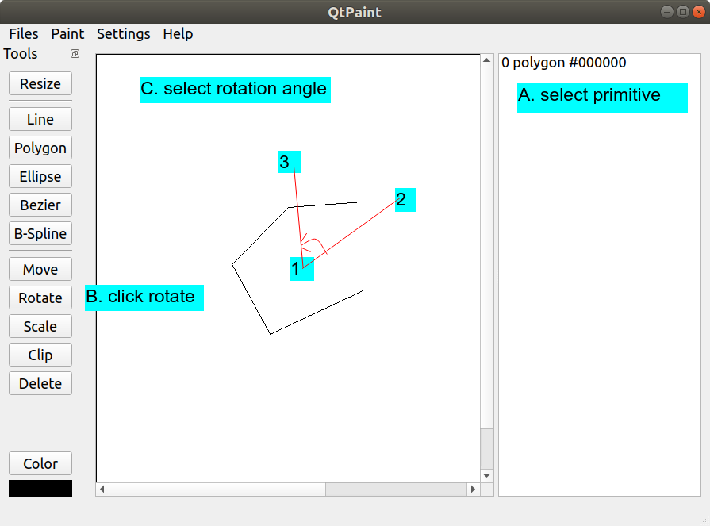

##### 缩放

首先在右侧的图元列表选择要移动的图元，然后点击Scale按钮。在画布上选择缩放的中心点，随后选择两个点确定缩放比例。

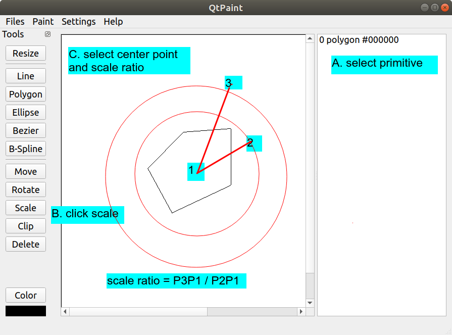

##### 缩放

首先在右侧的图元列表选择要移动的图元（必须是Line类型），然后点击Clip按钮。在画布上选择裁剪框即可完成裁剪。

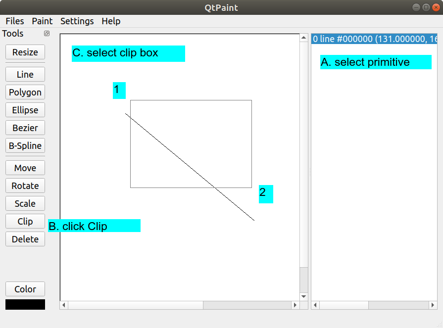

##### 删除

在右侧的图元列表选择要移动的图元，然后点击Delete按钮即可。

